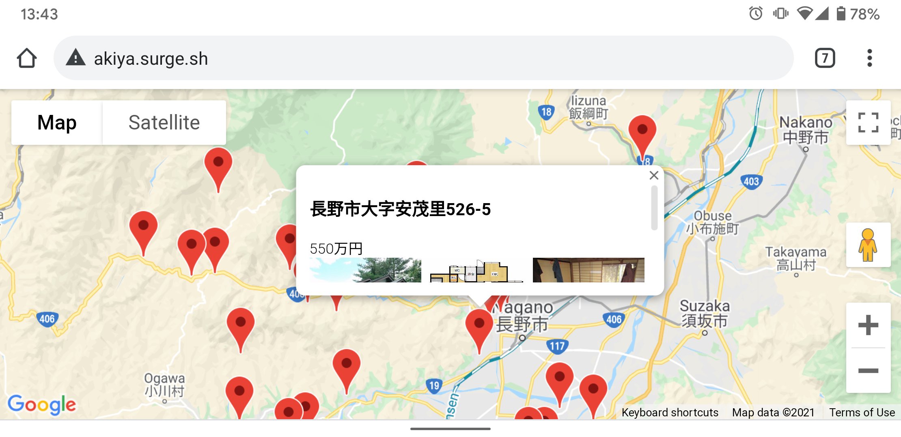

# Akiyan

Scraper for getting data of Japanese "empty houses" Akiya.



## functionality

As of now the site is hosted on [http://akiya.surge.sh](http://akiya.surge.sh) and lists only some entries in Nagano from [nagano-akiyabank.jp](http://nagano-akiyabank.jp).

It can only be run in http since the Nagano Akiyabank only runs on http, giving ssl cert issues on loading images on https.

It lists the entries with address, price, top three images and linking to the original entry.

## running scraper

First set your API key for Google Maps lookup:
```
export GMAPS_API_KEY=...
```

```shell
pipenv install
pipenv run scrapy runspider scraper/nagano.py -o web/nagano.json
```

### debugging

It's easiest to simply grab the url and run it in Scrapy shell:

```shell
pipenv run scrapy shell http://nagano-akiyabank.jp/search/
```

## API key

Needs to have privileges to the Google Maps API. The one coded in the html is restricted to only be used from surge.

## publish

```
npm install --global surge
surge ./web akiya.surge.sh
```